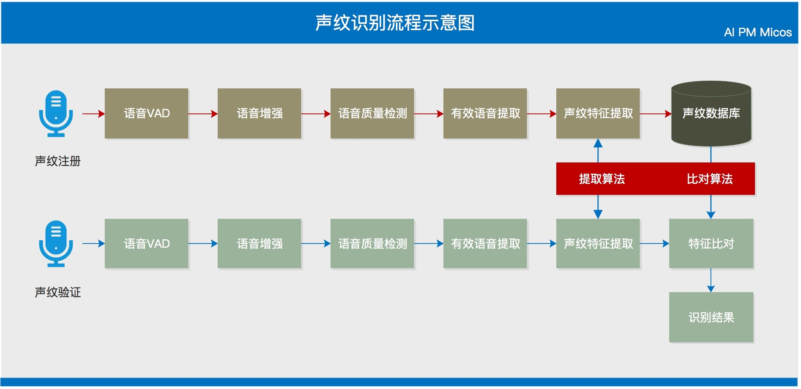

## 声纹识别
### 概述
基于X-vector模型的是声纹识别

### 设计与实现
X-Vector模型

声纹识别流程图

### 测试与分析

声纹确认识别系统的性能评价主要看两个参量，分别是错误接受率(False Acceptation Rate, FAR)和错误拒绝率(False Rejection Rate, FRR)。FAR是指将非目标说话人判别为目标说话人造成的错误。FRR是指将目标说话人误识成非目标说话人造成的错误。二者的定义如下：
$$错误接受率(FAR)=\frac{被接受的错误识别的语音样本数}{应被拒绝的语音样本数} \times 100\%
$$
$$
错误拒绝率(FRR)=\frac{被拒绝的正确识别的语音样本数}{应被接受的语音样本总数} \times 100\%
$$

在声纹识别系统中，可通过设定不同的阈值对FAR和FRR进行权衡。系统所要求的的安全性越高，则设定的阈值应越高，此时接受条件越严格，即FAR越低，但FRR越高；反之，如果系统追求较好的用户体验性(通过率高)，则阈值应越低，此时接受条件就越宽松，FAR就越高，但FRR就越低。一般采用检测错误权衡曲线(Detection Error Trade-ofs-Curve, DET)来反映两个错误率之间的关系：对一个特定的声纹识别系统，以FAR为横坐标轴，以FRR为纵坐标轴，通过调整其参数得到的FAR与FRR之间关系的曲线图，就是DET图。显然DET图离原点越近，系统性能越好。如图下所示，在测试集上的DET：

主要进行了含重放攻击和跨设备登录的声纹识别实验，未进行重放攻击检测时测试结果如下：
| 测试集   | 准确率 | EER  |
|-------|--------|------|
| 重放攻击 | 0.95   | 0.02 |
| 跨设备   | 0.91   | 0.09 |
>重放攻击包含8个说话人，共62条语音；每个说话人3条注册语音，其余为登录语音，包括重放攻击、他人等；  
>跨设备包括远场麦克风和近场Android和IOS设备，600个说话人，共4410条语音

其他情况分析
1. 说话人的不正常发音(感冒, 嘶哑, 假声)等对于识别有影响
2. 3条语音进行模型注册用时2.07s; 单条语音进行登录用时1.032s

### 创新性说明
1. 声纹识别过程：X-Vector提取embedding -> LDA降维进行长度归一化 -> PLDA进行打分
1.1 利用神经网络很强的学习能力进行特征提取, 比传统的i-vector更适用于短语音认证
1.2 PLDA打分, 减弱跨信道影响
2. 模型训练相关
2.1 数据增强, 使得模型可以适应不同环境, 增强模型泛化能力
2.2 可以跨语言识别